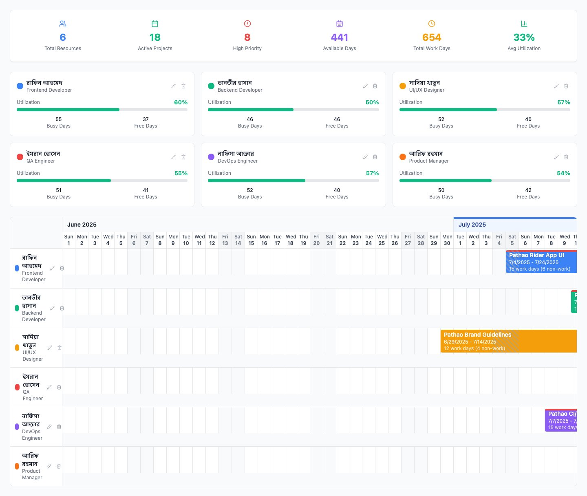
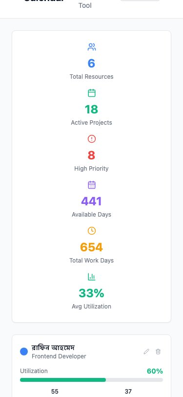
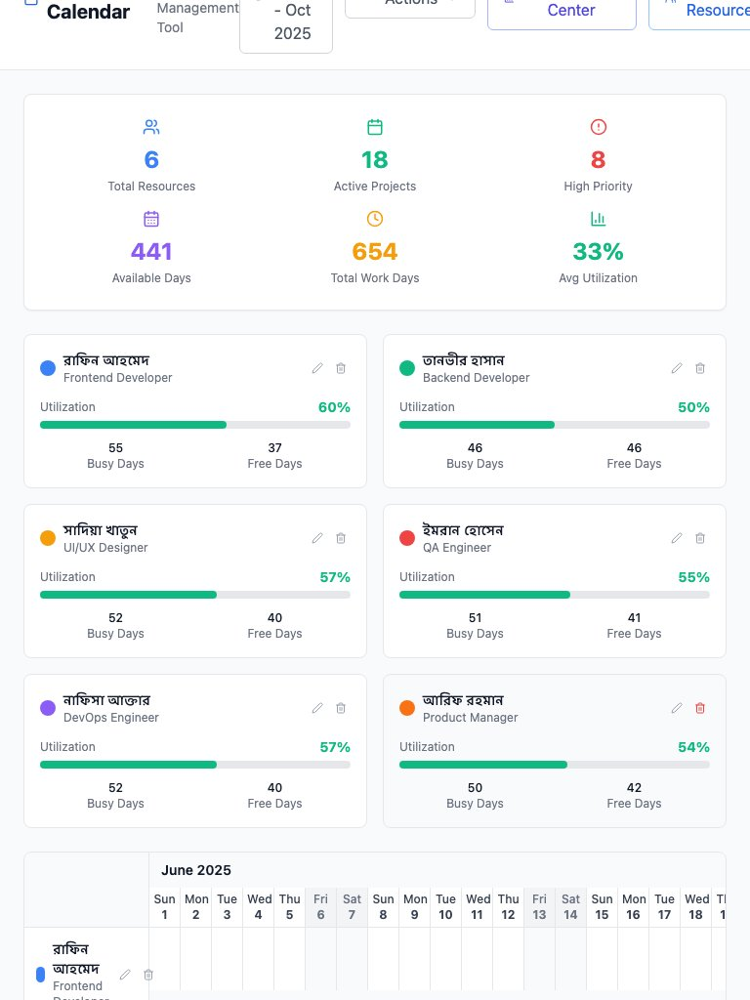

# 📅 Resource Calendar - Comprehensive Project Management System

[](https://reactjs.org/)
[](https://www.typescriptlang.org/)
[](https://tailwindcss.com/)
[](https://vitejs.dev/)
[](https://opensource.org/licenses/MIT)
[](https://github.com/nadimtuhin/resource-calendar-project-management/pulls)

A comprehensive resource calendar management system with project tracking, leave management, holiday configuration, and team analytics. Features Bengali localization and includes sample data with Pathao project templates for local businesses.

## 🎥 Live Demo

Try it live: [https://resource-calendar-project-management.vercel.app](https://resource-calendar-project-management.vercel.app)

## 📸 Application Preview


*Complete resource calendar with Bengali team data, contiguous project bars, holiday visualization, and comprehensive analytics*

## ✨ Features

### 🎯 Core Functionality
- **📊 Visual Resource Timeline** - Beautiful calendar view with contiguous project bars spanning multiple days
- **👥 Smart Resource Management** - Team members with roles, departments, and color coding
- **📈 Real-time Analytics** - Comprehensive project statistics and resource utilization tracking
- **🎯 Project Status Tracking** - Complete project lifecycle management (planning, active, on-hold, completed, etc.)
- **🔍 Advanced Overflow Detection** - Smart workload management with visual indicators
- **📱 Fully Responsive** - Optimized for all device sizes

### 🚀 Advanced Features
- **🗓️ Holiday Management** - Configurable weekends (Friday-Saturday for Bangladesh) and holiday calendar
- **🏖️ Leave Management** - Track employee leave days with timeline visualization
- **📊 Project Analytics** - Deadline tracking, work days calculation, and project health indicators
- **🔗 URL State Sharing** - Share calendar state via base64-encoded URLs
- **📅 Date Range Selection** - Flexible timeline views with customizable date ranges
- **🎨 Holiday Visualization** - Multi-layer holiday patterns within project bars

### 🌍 Localization & Templates
- **🇧🇩 Bengali Support** - Full Bengali names and localization
- **🚗 Pathao Templates** - Pre-built project templates for ride-sharing and delivery businesses
- **🎭 Smart Test Data** - Realistic sample data for quick exploration

### 💻 Technical Features
- **💾 Local Storage** - Automatic data persistence in browser
- **🎨 Modern UI/UX** - Clean modal-based management interface
- **⚡ Blazing Fast** - Instant updates with optimized performance
- **🔒 Privacy First** - No server required, all data stays local
- **🌈 Customizable** - Extensive color coding and visual customization

## 🚀 Quick Start

### Option 1: Clone and Run Locally

```bash
# Clone the repository
git clone https://github.com/nadimtuhin/resource-calendar-project-management.git

# Navigate to project directory
cd resource-calendar-project-management

# Install dependencies
npm install

# Start development server
npm run dev

# Build for production
npm run build
```

Visit `http://localhost:5173` to see the app in action!

### Option 2: Deploy Your Own

Deploy your own instance with one click:

[](https://vercel.com/new/clone?repository-url=https://github.com/nadimtuhin/resource-calendar-project-management)
[](https://app.netlify.com/start/deploy?repository=https://github.com/nadimtuhin/resource-calendar-project-management)

## 🛠️ Tech Stack

| Technology | Purpose |
|------------|---------|
| **React 18.3** | UI library with hooks |
| **TypeScript 5.5** | Type safety and better DX |
| **Tailwind CSS 3.4** | Utility-first styling |
| **Vite 5.4** | Lightning-fast build tool |
| **Lucide React** | Beautiful SVG icons |
| **Local Storage** | Client-side persistence |

## 📖 How It Works

### 1. Getting Started
- **Fresh Start**: Add your first team member manually
- **Quick Demo**: Load sample Bengali data with Pathao projects
- Access **Management Center** for comprehensive control

### 2. Team & Resource Management
- Create resources with Bengali names, roles, and departments
- Set working hours and holiday preferences
- Configure Friday-Saturday weekends (Bangladesh standard)
- Track leave days and work availability

### 3. Project Lifecycle
- Create projects with status tracking (planning → active → completed)
- Set deadlines and estimated work days
- Assign projects to team members with daily hour allocation
- Monitor progress with real-time analytics

### 4. Advanced Features
- **Holiday Management**: Configure holidays and see them in timeline
- **Leave Tracking**: Manage employee leave with work day calculations
- **State Sharing**: Export/import calendar data via URL sharing
- **Analytics**: Track project deadlines, work completion, and team utilization

### 5. Timeline Visualization
- See contiguous project bars spanning multiple days
- Holiday patterns within project periods
- Resource utilization indicators
- Overflow detection for overallocated resources

## 💡 Use Cases

### 🇧🇩 Local Bangladesh Businesses
- **Pathao/Uber Operations**: Track driver schedules, delivery assignments, and vehicle allocation
- **Software Companies**: Manage development teams with Bengali localization
- **Consulting Firms**: Handle client projects with local holiday calendar

### 🏢 Enterprise Teams
- **Software Development**: Sprint planning, bug tracking, and feature development
- **Creative Agencies**: Designer and developer allocation across client projects
- **Manufacturing**: Production scheduling with holiday and leave considerations
- **Healthcare**: Staff scheduling with shift management and leave tracking

### 🚀 Startups & SMEs
- **Resource Planning**: Optimize small team allocation across multiple projects
- **Client Work**: Track billable hours and project deadlines
- **Remote Teams**: Coordinate across different time zones and holiday calendars

### 👨‍💼 Individual Use
- **Freelancers**: Manage multiple client projects and availability
- **Consultants**: Track engagement schedules and maximize billable time
- **Project Managers**: Personal project tracking and timeline management

## 🎯 Why Resource Calendar?

| Problem | Our Solution |
|---------|--------------|
| Can't see team capacity | Visual timeline with contiguous project bars |
| Resource conflicts | Real-time utilization with overflow detection |
| Complex project management | Simple, intuitive modal-based interface |
| Expensive enterprise software | 100% free and open source |
| Data privacy concerns | Everything stays in your browser |
| Holiday/leave confusion | Built-in holiday calendar and leave management |
| Local business needs | Bengali localization with Pathao templates |
| State sharing difficulties | URL-based state sharing with base64 encoding |

## 📱 More Screenshots

### Empty State & Onboarding
Get started with sample data or create your own resources.


### Header Navigation
Streamlined navigation with action groups, management center, and date range selector.


### Main Content Area
Resource timeline with holiday visualization, project status tracking, and team analytics.



### Mobile Responsive Design
Optimized for mobile devices with touch-friendly interface and condensed layout.



### Tablet View
Perfect for mid-size devices with balanced layout and full feature access.



## 🤝 Contributing

We love contributions! Here's how you can help:

### Development Setup

```bash
# Fork and clone the repo
git clone https://github.com/nadimtuhin/resource-calendar-project-management.git

# Create a new branch
git checkout -b feature/amazing-feature

# Make your changes and commit
git add .
git commit -m 'Add amazing feature'

# Push to your fork
git push origin feature/amazing-feature

# Open a Pull Request
```

### Contribution Ideas
- 🐛 Bug fixes
- ✨ New features
- 📚 Documentation improvements
- 🎨 UI/UX enhancements
- 🌐 Internationalization
- ♿ Accessibility improvements

See our [Contributing Guide](CONTRIBUTING.md) for more details.

## 📋 Roadmap

### 🎯 Completed Features
- [x] Contiguous project bars spanning multiple days
- [x] Holiday management with Friday-Saturday weekends
- [x] Leave management with work day calculations
- [x] Project status tracking and analytics
- [x] URL state sharing with base64 encoding
- [x] Bengali localization with Pathao templates
- [x] Modal-based management interface
- [x] Enhanced empty state with test data prompt

### 🚀 Upcoming Features
- [ ] Project timeline visualization with milestones
- [ ] Project health indicators and risk assessment
- [ ] Project-specific analytics dashboard
- [ ] Drag and drop project allocation
- [ ] Export to CSV/Excel with Bengali support
- [ ] Team collaboration features
- [ ] Calendar sync (Google, Outlook)
- [ ] Mobile app (React Native)
- [ ] Dark mode with theme switching
- [ ] Custom reporting and dashboards
- [ ] API for third-party integrations
- [ ] Multi-language support beyond Bengali

## 🐛 Known Issues

- Calendar scrolling on mobile could be smoother
- Large datasets (>100 resources) may impact performance

See all [open issues](https://github.com/nadimtuhin/resource-calendar-project-management/issues).

## 📝 License

This project is licensed under the MIT License - see the [LICENSE](LICENSE) file for details.

## 🙏 Acknowledgments

- Built with amazing open source tools
- Inspired by the need for simpler project management
- Thanks to all contributors!

## 🌟 Support

If you find this project useful:

- ⭐ **Star** this repository
- 🐦 **Tweet** about it
- 📝 **Blog** about your experience
- 🤝 **Contribute** improvements
- ☕ **Sponsor** development

## 📬 Contact

**Nadim Tuhin**
- GitHub: [@nadimtuhin](https://github.com/nadimtuhin)
- Twitter: [@nadimtuhin](https://twitter.com/nadimtuhin)
- Email: [nadim.tuhin@gmail.com](mailto:nadim.tuhin@gmail.com)

---

<p align="center">Made with ❤️ by developers, for developers</p>
<p align="center">© 2025 Resource Calendar. All rights reserved.</p>